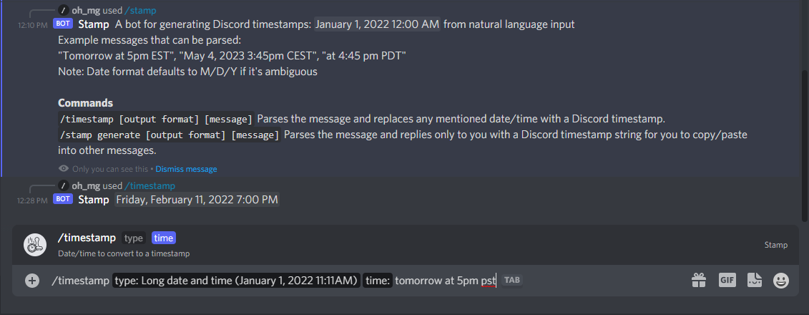

# Stamp

A Discord chat interaction (slash command) for generating user-timestamps. 



## Adding this interaction to your server
[Click here](https://discord.com/api/oauth2/authorize?client_id=941136915963445328&scope=applications.commands) to authorize
this interaction on your server. No further setup is required as this is the bot instance centrally hosted by us (gallowaylabs). 


## Setting up your own version

This application is tightly coupled to AWS; it uses [AWS CDK](https://docs.aws.amazon.com/cdk/v2/guide/home.html), 
an AWS-flavored Terraform tool, to deploy resources and uses AWS-specific features like Lambda and ApiGateway. 

Pre-requisites:
- An AWS account
- [AWS CLI V2](https://docs.aws.amazon.com/cli/latest/userguide/getting-started-install.html) installed and configured
- Node >16

1. Install AWS CDK globally
```shell
npm install -g aws-cdk
```

2. Install dependencies
```shell
npm i
```

3. Generate an application and bot in the [Discord developer portal](https://discord.com/developers/applications)
4. Copy example configuration to active configuration
```shell
cp .env.example .env
```
5. Fill in the `.env` configuration parameters with your AWS account id and Discord app/bot credentials
6. Deploy to AWS
```shell
cdk deploy --all
```
7. After deployment, CDK will print the base URL for the API. Copy that to the "Interactions Endpoint URL" under 
"General Information" in the Discord Developer Portal 
8. Publish the command interaction definitions to Discord
```shell
npm run publishCommands
```

To add your newly created interaction to a server that you administer:
1. in the Discord Developer Portal go to OAuth2 > URL Generator
2. Select "applications.commands"
3. Copy the generated link and go to it in a browser window where you're logged into Discord
4. Authorize the application
5. You can now use `/stamp` and `/timestamp` commands in the server you authorized

## Useful commands

 * `npm run build`   compile typescript to js
 * `npm run watch`   watch for changes and compile
 * `npm run test`    perform the jest unit tests
 * `cdk deploy`      deploy this stack to your default AWS account/region
 * `cdk diff`        compare deployed stack with current state
 * `cdk synth`       emits the synthesized CloudFormation template
 * `npm run publishCommands` publish interaction command structure to Discord


## Attribution
Timestamp icons created by Freepik - Flaticon: https://www.flaticon.com/free-icons/timestamp
